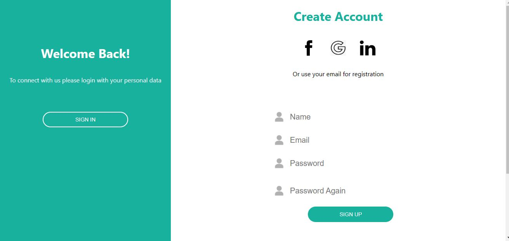

# User Sign In With React and Java Spring

With React and Java Spring, I developed a user sign in front-end and back-end. The front-end contains an animation when the user wants to switch between log in and sign up.

